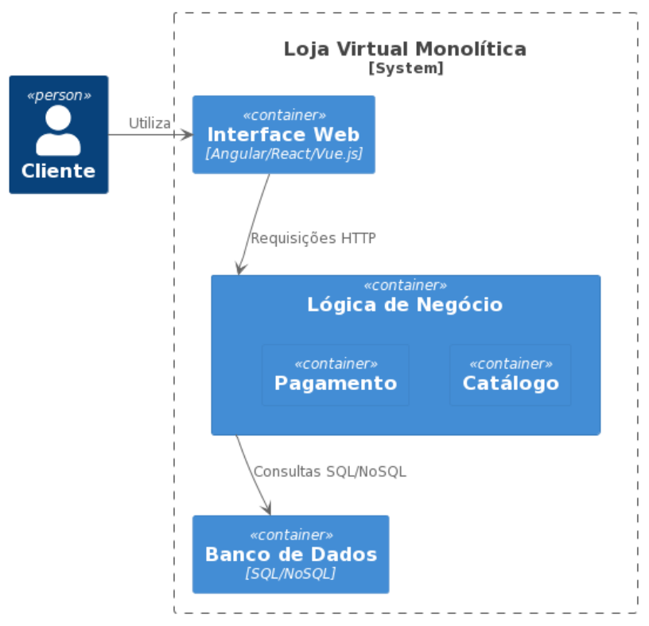

# Introdução às Aplicações Orientadas a Serviços (SOA)

_Objetivos da Aula:_

-   Compreender os conceitos básicos de Aplicações Orientadas a Serviços (SOA).
-   Explorar como SOA melhora a flexibilidade e a reutilização em sistemas de software.
-   Aprender sobre os principais componentes e princípios do SOA.
-   Visualizar a arquitetura SOA por meio de diagramas simples.

_Parte 1: Introdução ao SOA_

-   Definição de SOA: SOA é uma abordagem de design de software que enfatiza a criação de serviços independentes que podem ser reutilizados em várias aplicações.
-   Benefícios do SOA: Flexibilidade, reutilização de serviços, integração simplificada, etc.

_Parte 2: Componentes do SOA_

-   Serviços: são unidades funcionais independentes que podem ser invocadas via rede. Eles podem realizar funções específicas, como processar pagamentos, fornecer informações de estoque, etc.




-   Consumidores de Serviços: Os aplicativos ou sistemas que usam esses serviços são chamados de consumidores. Eles enviam solicitações aos serviços para obter funcionalidade.

_Parte 3: Princípios do SOA_

-   Padrões de Comunicação: HTTP, SOAP ou REST.

Chamada HTTP para REST (JSON):

```javascript
httpCopy code
GET /api/produtos/1
Host: example.com
Accept: application/json
```

Nesta chamada HTTP, estamos usando o método GET para solicitar informações sobre um produto específico com o ID 1 no formato JSON. O servidor deve responder com os detalhes do produto no corpo da resposta em
JSON.

Estrutura de Dados de Produto em REST (JSON):

```json
jsonCopy code
{
"id": 1,
"nome": "Produto de Exemplo",
"descricao": "Uma descrição detalhada do produto",
"preco": 50.00,
"estoque": 100
}
```

Esta é uma representação JSON de um objeto "Produto" no padrão REST. Ele inclui campos como "id", "nome", "descrição", "preço" e "estoque".

Chamada HTTP para SOAP (XML):

```xml
httpCopy code
POST /ProdutosService.asmx
Host: example.com
Content-Type: text/xml; charset=utf-8
Content-Length: 250
<soapenv:Envelope xmlns:soapenv="http://schemas.xmlsoap.org/soap/envelope/" xmlns:web="http://www.example.com/webservi
ces/">
    <soapenv:Header/>
    <soapenv:Body>
        <web:GetProduto>
            <web:ProdutoId>1</web:ProdutoId>
        </web:GetProduto>
    </soapenv:Body>
</soapenv:Envelope>
```

Nesta chamada HTTP, estamos usando o método POST para chamar um serviço SOAP chamado "GetProduto" com o parâmetro "ProdutoId" definido como 1. O servidor SOAP responderá com os detalhes do produto no corpo
da resposta em XML.

Estrutura de Dados de Produto em SOAP (XML):

```xml
xmlCopy code
<Produto>
    <Id>1</Id>
    <Nome>Produto de Exemplo</Nome>
    <Descricao>Uma descrição detalhada do produto</Descricao>
    <Preco>50.00</Preco>
    <Estoque>100</Estoque>
</Produto>
```

Esta é uma representação XML de um objeto "Produto" no padrão SOAP. Ela inclui elementos como "Id", "Nome", "Descricao", "Preco" e "Estoque".
Lembrando que o padrão REST geralmente utiliza JSON, enquanto o SOAP utiliza XML para representar dados. A escolha entre eles depende da tecnologia e dos requisitos do sistema que você está desenvolvendo.
Lembre-se de que as chamadas HTTP para serviços REST e SOAP podem variar dependendo da implementação específica do serviço e do endpoint do serviço. Os exemplos acima ilustram os tipos de solicitações que você faria para obter informações sobre um objeto "Produto" nos padrões REST e SOAP.

_Parte 4: Modelagem API REST_

_Recursos (Endpoints):_

-   _`/api/produtos`_: Representa a coleção de produtos.
-   _`/api/produtos/{id}`_: Representa um produto específico com um ID único.

_Métodos HTTP:_

-   _`GET /api/produtos`_: Recupera a lista de todos os produtos.
-   _`GET /api/produtos/{id}`_: Recupera detalhes de um produto específico por ID.
-   _`POST /api/produtos`_: Cria um novo produto.
-   _`PUT /api/produtos/{id}`_: Atualiza os detalhes de um produto existente.
-   _`DELETE /api/produtos/{id}`_: Exclui um produto existente.

CRUD (Create / Retrieve / Update / Delete);

_Estrutura de Dados do Produto (JSON):_

```
{
    "id": 1,
    "nome": "Produto de Exemplo",
    "descricao": "Uma descrição detalhada do produto",
    "preco": 50.00,
    "estoque": 100
}
```

Aqui estão exemplos de solicitações HTTP para a API de produtos:

-   _Recuperar todos os produtos (GET):_
    ```
    GET /api/produtos
    ```
-   _Recuperar um produto específico (GET):_
    ```
    GET /api/produtos/1
    ```
-   _Criar um novo produto (POST):_

    ```
    POST /api/produtos
    Content-Type: application/json

    {
        "nome": "Novo Produto",
        "descricao": "Descrição do Novo Produto",
        "preco": 29.99,
        "estoque": 50
    }
    ```

-   _Atualizar um produto existente (PUT):_

    ```
    PUT /api/produtos/1
    Content-Type: application/json

    {
        "nome": "Produto Atualizado",
        "descricao": "Descrição Atualizada",
        "preco": 34.99,
        "estoque": 75
    }
    ```

-   _Excluir um produto existente (DELETE):_
    ```
    DELETE /api/produtos/ 1
    ```

Esta é uma estrutura básica para modelagem de uma API REST para gerenciar produtos. Lembre-se de que a autenticação, autorização e validações adequadas devem ser implementadas, dependendo das necessidades do seu sistema. Além disso, é importante seguir as melhores práticas de design de API REST, como usar os códigos de status HTTP apropriados e estruturar as URLs de forma lógica.
