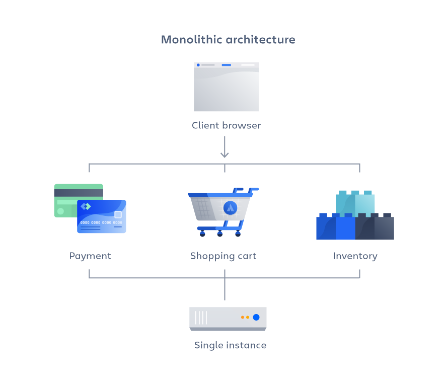
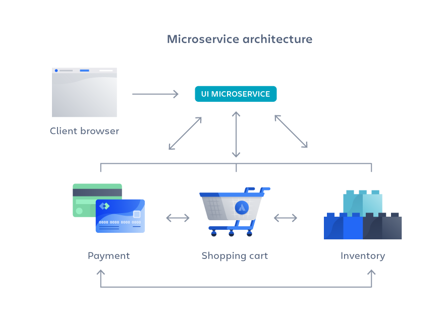

# Um pouco sobre arquitetura de aplicações

Independentemente da linguagem de programação que adotarmos durante o desenvolvimento, é importante entendermos que existem diferentes abordagens para a construção de aplicações web. Para esclarecer um pouco dessas diferenças, de forma básica citamos muitas vezes durante este curso que o software que estávamos construindo tinha o papel de entregar "uma ou mais páginas web" ou então "um conjunto de dados".

Este olhar inicial (apesar de bastante raso), ajuda o desenvolvedor a entender que existem diferentes propostas de implementação, dependendo é claro do objetivo que se quer alcançar com a construção de uma aplicação.

Se nos aprofundarmos mais no assunto, descobriremos então que ele é muito mais amplo, e será bastante comum você ouvir em algumas discussões sobre diferentes tipos de padrões de arquitetura que podem ser adotados na construção de sua aplicação. Entre as disponíveis, existem duas especialmente que gostaríamos de apresentar neste módulo, que são as seguintes:

-   Arquitetura monolítica
-   Arquitetura de microsserviços

Como objetivo final, ambas têm a mesma intenção, que é entregar um software que atenda aos requisitos do negócio em que você está trabalhando, porém, a forma com que estas aplicações serão construídas terão algumas diferenças que caberão ao desenvolvedor decidir a melhor abordagem para aplicá-las.

# Arquitetura de aplicações monolíticas

Chamamos de aplicações monolíticas softwares que durante sua construção foram projetadas de forma a integrar a interface de usuário e a camada de acesso a dados em uma única solução. Nesta arquitetura, o software compartilha os mesmos recursos relativos a processamento, memória, banco de dados e uso do sistema de arquivos. Esta abordagem de desenvolvimento, adota uma quantidade significativa de vantagens e desvantagens, como veremos a seguir:

# Vantagens da arquitetura monolítica

O desenvolvimento é relativamente mais fácil e rápido, pelo fato de a aplicação ser construída em uma mesma base de código

Facilidade de implementação e consequente implantação, pois a aplicação possui um único arquivo executável ou mesmo um diretório contendo os arquivos

Por utilizar a mesma base de código, as execuções a nível de API podem ter uma performance aprimorada, que em outra arquitetura poderia estar distribuída em diversos servidores.

Simplificação nos chamados testes end-to-end (ponta a ponta), pelo fato da aplicação ser uma unidade única e centralizada

Facilidade no processo de troubleshooting, pois o como o código é localizado num único ponto é relativamente mais simples seguir a solicitação e encontrar o problema.

# Desvantagens da arquitetura monolítica

Aumento da complexidade e tamanho ao longo do tempo, tornando o software de difícil manutenção e por consequência maior custo.

Alta dependência de componentes de código, onde alterações efetuadas em trechos altamente acoplados podem causar efeitos colaterais em outras partes do sistema.

Escalabilidade do sistema é limitada, onde geralmente a abordagem é escalar a aplicação verticalmente, aumentando recursos como processador, memória e disco.

Falta de flexibilidade, fazendo com que os desenvolvedores não possam abandonar uma determinada Stack de desenvolvimento (trocar a linguagem por exemplo).

A seguir, apresentamos um diagrama a fim de tornar lúdico um pouco deste padrão:

# Arquitetura de aplicações orientadas à microsserviços

Na contramão do que temos na arquitetura monolítica, os microsserviços servem como padrão para construção de pequenas aplicações, que funcionam de forma especializada e independente, mas que interagem entre si para a construção da solução final. Por serem separados em partes menores, os recursos relativos a processamento, memória e discos não são compartilhados, e denotam também algumas vantagens e desvantagens, que destacaremos a seguir:

# Vantagens da arquitetura de microsserviços

Serviços com baixo nível de acoplamento e interdependência, onde as manutenções serão específicas a uma determinada aplicação. Por exemplo, ao fazer uma alteração no microsserviço que cuida das notificações promocionais de uma loja virtual, mesmo que esta sofra uma indisponibilidade o impacto será pequeno visto que o microsserviço responsável por processar os pedidos do cliente é independente.

Escalabilidade do sistema, onde os deploys são feitos em arquitetura baseadas em cloud computing, que por serem mais modernas e utilizarem recursos como máquinas virtuais e containers, permitem que o software possa ser escalado horizontalmente de forma automatizada, isto é, de acordo a necessidade de tráfego direcionada ao sistema em específico.

Controle de custos, uma vez que por conta das automações podemos provisionar a aplicação para que utilize recursos mínimos caso essa não seja tão exigida em ambiente produtivo.

Flexibilidade de tecnologia, uma vez que os microsserviços são independentes os times de tecnologia podem utilizar diferentes soluções relativas ao uso de linguagens, sistemas de banco de dados etc.

Facilidade de colocar alterações em produção, uma vez que indisponibilidades durante o processo de deploy não afetam todos os demais sistemas. Nos processos de desenvolvimento moderno, esteiras de desenvolvimento promovem uma infraestrutura em que, de forma contínua, novas versões do software são entregues em produção com o mínimo de indisponibilidade.

# Desvantagens da arquitetura de microsserviços

Em geral, construir sistemas nessa arquitetura adicionam maior complexidade que a arquitetura monolítica, já que existirão serviços em vários lugares e que serão desenvolvidos por diferentes equipes, o que se não gerenciado adequadamente pode impactar na velocidade de desenvolvimento destas equipes.

De acordo com a demanda, um novo microsserviço pode adicionar custos exponenciais de infraestrutura, isto é, de acordo com as práticas adotadas para testes, implantação, monitoramento etc.

O alinhamento entre as equipes de desenvolvimento precisa ser bastante coeso, pois facilmente podem-se quebrar contratos de comunicação entre as interfaces de diferentes partes do software.

Como cada microsserviço tem um conjunto próprio de registros, o processo de troubleshooting fica mais complicado, desde a análise do tracing de navegação do usuário entre os sistemas, e pelo fato do mesmo poder ser destruído em diferentes instâncias (máquinas)

Sem a necessidade de uma plataforma comum, inúmeras linguagens podem ser utilizadas em sua construção, o que pode dificultar o trânsito de desenvolvedores para diferentes equipes que não dominam uma determinada Stack de desenvolvimento.

Com a escalada no desenvolvimento de microsserviços, é necessário ter um mapa das aplicações desenvolvidas, sob pena de não conseguir reaproveitar sistemas já construídos e literalmente reinventar a roda.

A seguir, apresentamos um diagrama a fim de tornar lúdico um pouco deste padrão:

# O que é uma API (Application Programming Interface)?

No tópico anterior, exploramos alguns aspectos a respeito da construção de softwares que adotam a arquitetura de microsserviços. Nele citamos, que este tipo de software tem responsabilidade específica e capacidade de interagir com outros sistemas do mesmo tipo, mas talvez uma pergunta não tenha sido integralmente respondida: afinal, como os microsserviços interagem entre si?

Para respondermos, basta entendermos que o padrão que permite que um software consiga "conversar" com outro software é chamado de API. Usualmente, o software "A" conseguirá executar uma requisição ao software "B" que então devolverá um conjunto de dados estruturados, utilizando formatos conhecidos no mercado (como XML, JSON, etc).

# Casos de Uso

A grande sacada da utilização de APIs, é que elas fornecem um padrão unificado para comunicação de diversos tipos de dispositivos. Então uma mesma aplicação pode ser acionada para fornecer um conjunto de dados que pode ser utilizado em um aplicativo nativo para celulares (Android ou IOS) e ao mesmo tempo também ser a fonte para processar uma página web (Browser).

Outro ponto interessante, é que durante a integração dos sistemas não existe nenhuma preocupação quanto a tecnologia adotada para o desenvolvimento de cada API. Em resumo, uma aplicação escrita em Node.js é capaz de se comunicar com outra desenvolvida em Python de forma transparente.

Por fim, vale destacar que existem no mercado ferramentas capazes de mapear as entidades em um banco de dados e então expô-las no formato de uma API. Essa característica é capaz de acelerar o processo de desenvolvimento de uma aplicação.

# Tipos de API

No processo de construção de nossas APIs, existem diferentes estratégias que podem ser adotadas. Se categorizadas, existem 3 tipos principais:

-   API Pública - construídas para que desenvolvedores fora da organização possam realizar integrações a serviços existentes

-   API Externa - desenhadas para serem públicas, porém destinadas à integração com outra organização (empresa) devidamente autorizada.

-   API Interna - tem por característica principal serem completamente inacessíveis fora da organização (empresa), mas podem ser agregadas a APIs Externas.

# Terminologias Comuns

Existe um conjunto grande de terminologias, muito comuns no escopo de desenvolvimento e utilização de APIs, são elas:

-   **Endpoint** - um endereço (URL) que executa uma determinada ação quando invocado

-   **Parameter** - um ou mais dados que podem ser enviados a API

-   **API Call** - quando uma aplicação (por exemplo um APP de celular) faz uma requisição à uma API

-   **Stateless** - processos onde os recursos consumidos não podem ser reutilizados, ou seja, nenhuma informação relativa a execuções anteriores é armazenada

-   **API Keys** - promovem uma camada de autenticação e autorização para o consumo dos endpoints de uma API

-   **CORs** - quando devidamente configurado, permite que requisições provenientes de outros domínios sejam corretamente atendidas pela API

# Referências e Materiais Complementares

[Microsserviços versus arquitetura monolítica](https://www.atlassian.com/br/microservices/microservices-architecture/microservices-vs-monolith)

[O que é API e para que serve?](https://www.techtudo.com.br/listas/2020/06/o-que-e-api-e-para-que-serve-cinco-perguntas-e-respostas.ghtml)
